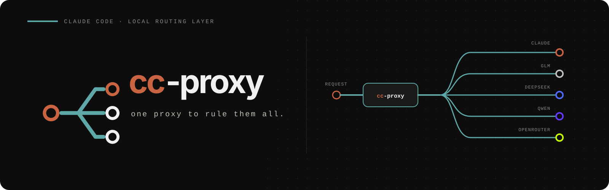

<p align="center">
  
</p>

# cc-proxy

A Claude Code plugin + local proxy that lets you use **GLM (Z.ai)**, **OpenRouter**, **DeepSeek**, **Qwen**, and **Claude** side-by-side in one session. Switch backends with `/model` — no restart. Zero runtime dependencies.

The proxy sits at `http://localhost:4000`, routes each request by its model name, applies the right auth per backend, and forwards to the upstream API. It stays a transparent pipe — every Claude Code tool, subagent, and prompt-cache works unchanged.

## How routing works

```
Claude Code → cc-proxy (:4000) → GLM | OpenRouter | DeepSeek | Qwen | Claude

  glm-*              → GLM         (x-api-key)
  vendor/model       → OpenRouter  (Bearer, opt-in)
  deepseek-*         → DeepSeek    (x-api-key, opt-in)
  qwen*             → Qwen        (Bearer, opt-in)
  claude-*           → Claude      (OAuth passthrough)
  claude-haiku-*     → Claude      (internal ops, always)
  unknown            → default backend (claude)
```

- **Context overflow.** A non-streaming GLM overflow is returned as a `400` the user sees; a streaming overflow surfaces as Claude Code's own context-limit message (synthesized from the SSE `stop_reason`). The proxy does not retry or reroute — manage context at the session level: switch model, `/clear`, or `/compact`.
- **Rate limits.** GLM's `1302` rate-limit response (HTTP `429`) carries no `Retry-After`, so Claude Code surfaces it as a hard error. The proxy injects `Retry-After: 30` (on both the streaming and buffered paths) so the client backs off and retries on its own. It stays stateless — no in-proxy wait or replay. The sibling `1113` (insufficient balance) and other `429`s are passed through untouched, so they get no misleading retry hint.
- **Thinking blocks stripped** from history so backends don't reject each other's signatures when you switch mid-session.

## Install

```bash
claude plugin marketplace add betmoar/ccp-market
claude plugin install cc-proxy@betmoar
```

Or install standalone straight from this repo (no central marketplace), using
the bundled `.claude-plugin/marketplace.json`:

```bash
claude plugin marketplace add betmoar/cc-proxy-plugin
claude plugin install cc-proxy@cc-proxy-plugin
```

## Setup

Inside Claude Code:

```
/cc-proxy:setup
```

It writes your **API keys to `~/.env`** (the single source of truth the proxy reads at startup) and merges the non-secret **plumbing into `~/.claude/settings.json` `env`**, registering `glm-5.2[1m]` in the `/model` picker:

| Key | Where | Purpose |
| --- | --- | --- |
| `GLM_API_KEY` | `~/.env` | Your Z.ai key (forwarded as `x-api-key`). Optional, like every backend key — with none set, the proxy still starts and routes everything to Claude |
| `ANTHROPIC_BASE_URL=http://127.0.0.1:4000` | settings.json `env` | Route API calls through the proxy |

The proxy binary is found automatically: the SessionStart hook spawns `bin/cc-proxy.js` from its own plugin tree, which is always the installed version. After a plugin update, the hook also detects a still-running older proxy (via the version on `/_status`) and replaces it gracefully — no manual restart.

**`/cc-proxy:setup` starts the proxy before it finishes**, so a fresh session connects with no `ECONNREFUSED`. Claude Code re-applies `ANTHROPIC_BASE_URL` to *already-open* sessions immediately, though — if one errors before the proxy came up, `/exit` + `/resume` it to reconnect (the SessionStart hook also ensures the proxy is running).

## Usage

Switch backends with `/model`:

- `/model glm-5.2[1m]` — GLM, 1M context (also `glm-5-turbo`, `glm-4.7`)
- `/model opus` / `/model sonnet` — Claude
- An OpenRouter id like `anthropic/claude-opus-4` or `z-ai/glm-4.7` — OpenRouter (set `OPENROUTER_API_KEY` first)
- A DeepSeek id like `deepseek-v4-pro` or `deepseek-v4-flash` — DeepSeek (set `DEEPSEEK_API_KEY` first)
- A Qwen id like `qwen3.7-max` or `qwen3.6-flash` — Qwen (set `DASHSCOPE_API_KEY` first)
- `lmstudio:<model-id>` — LM Studio, e.g. `lmstudio:openai/gpt-oss-20b` (set `LMSTUDIO_BASE_URL` first). Selector-only: local model ids are arbitrary and change as you load/unload models, so no bare id routes to LM Studio by shape — and ids like `glm-…` or `openai/…` loaded there would otherwise be stolen by the GLM/OpenRouter routing above. (One explicit exception: `DEFAULT_BACKEND=lmstudio` also makes it the fallback for unmatched ids — that is you deliberately pointing the default at your local box.)

Routing decisions land in `~/.claude/cc-proxy/cc-proxy.log` (`PROXY_DEBUG=1` for per-request detail).

## Model discovery

`GET http://127.0.0.1:4000/v1/models` returns a best-effort, Anthropic-format
list of reachable models: GLM, DeepSeek, Qwen, and OpenRouter are fetched live;
only Claude is a curated list. Each live leg falls back to a curated list if the
fetch fails, so the response is still `200` and names the failed provider in a
non-standard `_errors` array. Set `OPENROUTER_MODELS` to pin the OpenRouter ids
explicitly and skip its live fetch.

Entries a backend serves but this proxy cannot use — multimodal ids wanting a
different request schema, `:batch` variants, `~latest` aliases — are published
with `usable: false` rather than dropped, so a consumer can show them greyed out
instead of wondering where they went. The field is **absent** on usable entries;
check with `entry.usable !== false`. It means "cannot complete a **turn**", not
"unreachable" — the plan's image models are flagged and still work, on the
separate endpoint below.

### `?dedup=identity` — one entry per model

The same model is reachable under several ids, because the id names the ROUTE as
well as the model: `deepseek-v4-pro` (native), `qwen:deepseek-v4-pro` (plan) and
`deepseek/deepseek-v4-pro` (OpenRouter) are one model on three routes. Picking
"one model per `provider`" therefore picks the same model twice, silently.

`GET /v1/models?dedup=identity` collapses those to one entry each, keeping the
**lowest `tier`** — same weights, cheapest route. A `usable` entry always beats
an unusable one, whatever its tier. Opt-in: with no parameter the response is
exactly what it has always been, and an unrecognized `dedup=` value is a `400`
rather than a quietly un-deduped list.

The identity is the id after its **first** separator (`qwen:deepseek-v4-pro` →
`deepseek-v4-pro`, `z-ai/glm-5.3` → `glm-5.3`). An OpenRouter variant suffix
stays attached — `google/gemini-3.7-flash:batch` is not `gemini-3.7-flash` —
because the batch endpoint is a different way to reach the model, not a
substitute for it.

Entries whose id has a curated context window also carry a non-standard
`context_window` — an **integer token count** (`1000000`, not `"1M"`). ids
without a curated window (the OpenRouter-prefixed `vendor/model` ids, and
`claude-*`) **omit the field entirely** rather than sending `null`, so a
consumer tells "unknown" from "known" with `"context_window" in entry`.

Claude Code itself can consume this list: `CLAUDE_CODE_ENABLE_GATEWAY_MODEL_DISCOVERY=1` makes
CC fetch `/v1/models` at startup and populate the `/model` picker. Measured (CC 2.1.250): CC keeps
**only ids matching `claude` or `anthropic`**, requires `ANTHROPIC_AUTH_TOKEN` to be set (which
demotes the claude.ai OAuth login), and ignores every other backend's ids — so for third-party
models the one-custom-slot workflow above remains the way. See [`docs/OPERATIONS.md`](docs/OPERATIONS.md).

Every entry also carries `provider` (which backend serves it) and `tier`, plus
`grade` **when the model has been assessed**. **`tier` and `grade` are different
axes and must not be read off one another:** `tier` is what the route COSTS
(`1` Anthropic/OAuth, `2` prepaid plan, `3` metered credits, `4` reseller),
`grade` is what the model can DO — exactly one of `Flagship`, `Strong`, or
`Specialist` (NARROW, not weak). A resold Flagship is tier 4 and Flagship; a
plan-served flagship is tier 2 and Flagship.

An id nobody has assessed **omits `grade` entirely**, the same rule
`context_window` follows — check with `"grade" in entry`, never a null check,
and never assume a value. Most of the ~320 discovered ids are unassessed. This
changed in 0.6.1: they previously all shipped `Specialist`, which read as a
verdict on models nobody had looked at. `Economy` was retired in the same
release — it named a *cost* class on a *capability* axis, which is the one thing
the tier/grade split exists to prevent.

## Choosing a route

The **bare id routes to the native backend when one is configured**, otherwise
to the cheapest backend serving it. Every route stays selectable under a
`<provider>:<model>` prefix:

```
/model deepseek-v4-pro           # native DeepSeek (when DEEPSEEK_API_KEY set), else the plan
/model deepseek:deepseek-v4-pro  # DeepSeek's own endpoint, explicit
/model qwen:deepseek-v4-pro      # the Qwen plan copy, explicit
/model deepseek/deepseek-v4-pro  # via OpenRouter (a real OpenRouter id, unchanged)
```

Native wins over a cheaper resold route on purpose: a plan gateway injects a
preamble (measured at **+79 input tokens** on `deepseek-v4-pro`), so the native
and plan routes are not behaviourally interchangeable, and the bare id is the
one `/model` sets — defaulting it to the plan would silently reroute a prompt
tuned against native weights. If you hold the plan but not a native DeepSeek
key, the bare id falls back to the plan (the native route isn't registered).
The prefix is local to cc-proxy — it is stripped before the request is
forwarded, so the backend only ever sees its own id. `claude-haiku-*` ignores
any prefix and always goes to Anthropic.

In the discovery list, **which spelling appears bare is decided by namespace
ownership, not by routing**: each backend lists ids in its own namespace bare
and every foreign id it serves under the `<provider>:` lens. So `deepseek-v4-pro`
is bare under DeepSeek and `qwen:deepseek-v4-pro` under the plan — whichever of
the two the bare id resolves to. Listing and routing are deliberately
independent.

## Image generation on the Qwen plan

The Token Plan includes `wan2.7-image` and `wan2.7-image-pro`. They cannot serve
a `/model` turn — the Anthropic skin rejects their body shape, which is why they
carry `usable: false` — but they answer on DashScope's own media path, and the
proxy forwards it:

```bash
curl -X POST http://127.0.0.1:4000/api/v1/services/aigc/multimodal-generation/generation \
  -H 'content-type: application/json' \
  -d '{"model":"wan2.7-image",
       "input":{"messages":[{"role":"user","content":[{"text":"a red cube on white"}]}]},
       "parameters":{"size":"1024*1024"}}'
```

A **tunnel, not a translation** — the body is forwarded byte-for-byte and the
response is the vendor's own. All the proxy adds is the credential, so a caller
needs no `DASHSCOPE_API_KEY` of its own. Requires the key to be configured; with
none, the path answers `503` rather than routing anywhere else. Set
`x-dashscope-sse: enable` to stream.

The image comes back as a **signed URL with an `Expires`**, not inline base64 —
fetch it before that passes. The plan's audio ids (`qwen-audio-3.0-tts-plus`,
`-realtime-plus`) have **no working route**: measured 2026-08-25, every HTTP path
rejects them and the WebSocket task fails inside the vendor's engine.

## Commands

The plugin ships slash commands that reach proxy backends **without changing your session model**.

**Commands:**

- `/cc-proxy:status` — proxy liveness, configured providers + default backend, provider quotas (GLM, OpenRouter, DeepSeek), and recent routing decisions. Reads the proxy's `/_status` endpoint and tails `~/.claude/cc-proxy/cc-proxy.log`; works whether the proxy is up or down.
- `/cc-proxy:models` — every model reachable through the proxy, with the provider each one routes to. Reads the proxy's `GET /v1/models` and attributes ids against the registered providers' predicates; a failed live-fetch leg is flagged. Raw JSON is one `curl http://127.0.0.1:4000/v1/models` away.
- `/cc-proxy:bench grades` — refresh model grades from [benchlm.ai](https://benchlm.ai) (capability) joined with OpenRouter (price), written to `~/.claude/cc-proxy/grades.json`. Manual by design: nothing fetches on a timer. `grade` comes from the vendor's own version ordering, not the benchmark score — the score ships alongside it as its own field, with an `evidence` marker so a measured number is distinguishable from an inferred one.
- `/cc-proxy:bench speed` — time one minimal turn per route, appending to `~/.claude/cc-proxy/speed.jsonl`; `/cc-proxy:bench speed --report` gives median and p95 over the series (one ping is noise). Each row records the proxy's PID and version, so a series spanning a binary swap is flagged rather than silently averaged. It measures the **route**, never capability, and skips `claude-*` by default (OAuth passthrough has no credential to forward from a script, so it 401s regardless of route health).

> The GLM offload subagents (`glm-bulk-reader`, `glm-review-*`, `glm-brainstorm`) have moved to a dedicated plugin: [`betmoar/cc-agents-plugin`](https://github.com/betmoar/cc-agents-plugin).

## Model assignment

- **Primary model** — set `ANTHROPIC_DEFAULT_OPUS_MODEL` / `ANTHROPIC_DEFAULT_SONNET_MODEL` to `glm-5.2[1m]` in settings.json `env`. These drive the main conversational turns.
- **Handoff / subagent model** — use `glm-4.7` explicitly via `/model` or a subagent's own `model` field.
- **Do NOT set `ANTHROPIC_DEFAULT_HAIKU_MODEL` to a `glm-*` id.** Claude Code uses the haiku tier for internal ops (titles, summaries, quick tool calls). If you redirect it to a GLM id those requests arrive as `model:"glm-4.7"`, miss the `claude-haiku-*` pin, route to GLM, and burn GLM quota on overhead. Keep the haiku tier on Claude.

## Adding a provider

Routing is a data-driven registry in [`src/providers.js`](src/providers.js): each backend is one entry with a `match(model)` predicate, a base URL, and an auth strategy (`oauth` / `apiKey` / `bearer`). Adding a backend is one entry — no router changes. Providers must speak the Anthropic Messages API (or a compatible "skin"); there is no format-translation layer. See [`CONTRIBUTING.md`](CONTRIBUTING.md).

## Local dev

```bash
cp .env.example .env   # set GLM_API_KEY (and OPENROUTER_API_KEY if used)
pnpm install
pnpm proxy             # standalone on PROXY_PORT (default 4000)
pnpm test && pnpm lint
pnpm probe:vendors     # MANUAL: re-measure the vendor behaviour source comments claim
```

`probe:vendors` is deliberately outside `pnpm check` — it spends real quota
against real keys. It re-issues the requests behind claims like "this vendor
rejects a `[1m]`-suffixed model id" and exits non-zero if a vendor no longer
answers the way a comment says it does.

`bin/cc-proxy.js` loads API keys from `~/.env` (canonical for installs) and, if present, the repo-root `.env` (dev/inline). Vars already in the environment (e.g. settings.json `env`) always win. For the installed plugin, just the two keys go in `~/.env`; `/cc-proxy:setup` writes them there. Both files are gitignored.

To load this checkout as a plugin without going through the marketplace, launch Claude Code with the repo as a plugin dir:

```bash
claude --plugin-dir .
```

## Statusline (optional)

```json
{
  "statusLine": {
    "type": "command",
    "command": "node ~/.claude/plugins/cache/betmoar/cc-proxy/<version>/scripts/statusline.js"
  }
}
```

Compact composed-bar format, designed to sit alongside other plugins' segments:

```
cc 5h:2% | glm 5h:14% | or:$$$ | ds:$$ | qw:on
```

- **`cc` / `glm` 5h** — usage percentage, green→yellow→red by load. When a quota hits 100% (exhausted), the percentage is replaced by a red reset countdown `⏱3h11m`, since at that point the only useful signal is when access returns.
- **`or:`** — OpenRouter credits remaining (when `OPENROUTER_API_KEY` is set), as `$`-tiers by digit count: `$1–9`=`$`, `$10–99`=`$$`, `$100–999`=`$$$`, `$1000+`=`$$$$`. Empty balance shows `$0`; an unavailable balance shows `--`.
- **`ds:`** — DeepSeek balance remaining (when `DEEPSEEK_API_KEY` is set), same `$`-tier gauge as `or:`. Reports total balance (DeepSeek exposes no used figure).
- **`qw:`** — Qwen presence marker (when `DASHSCOPE_API_KEY` is set). Deliberately not a gauge: QwenCloud exposes no quota API reachable with an API key — the console's own remaining-percentage figure is authenticated by a browser login session. So the marker carries no number rather than fabricating one.
- **`proxy down`** in bold red when the local proxy is unreachable.
- **`!`** after a gauge — the number shown is the last good one, because the 60 s cache has expired and a fresh value isn't in yet. **A brief `!` is normal, not a fault.** It appears on the render that finds the cache expired and clears once the background refresh lands, so you see it for roughly two redraws (~0.5 s) about once a minute. Several gauges can carry it at once and clear at different times — `glm` clears last, since it is the slowest endpoint (~1.1 s, against ~0.3 s for `ds:` and ~20 ms for `or:`).

  What is *not* normal is `!` that **persists for many seconds or never clears** — that means the refresh is failing rather than merely pending. See [Troubleshooting](#troubleshooting).
- **`?`** after the `glm` gauge — the local clock disagrees with the vendor's by more than a minute, so the reset countdown is off by that much. `/cc-proxy:status` names the offset and direction.

**The bar never waits on the network.** Every render reads only local cache files; when something is past its 60 s TTL the stale value is served immediately and a detached background process refreshes it for the next render. One expiry costs exactly one round of API calls no matter how often the bar redraws.

When the [cc-status](https://github.com/betmoar/cc-status-plugin) composer is the active statusLine, this segment is discovered and composed automatically via `.claude-plugin/statusline.json` — no manual wiring needed.

The statusline runs as its own subprocess and only inherits `settings.json`'s `env` block, not the proxy's dotenv. So the `glm`/`or:`/`ds:` gauges still render when `GLM_API_KEY`/`OPENROUTER_API_KEY`/`DEEPSEEK_API_KEY` live in `~/.env`, it loads `~/.env` (+ repo `.env` in dev) at startup; keys already in the environment still win, and it's a no-op if neither file is present.

## Environment variables

| Variable | Default | Purpose |
| --- | --- | --- |
| `ANTHROPIC_BASE_URL` | — | Set by setup to `http://127.0.0.1:4000` |
| `GLM_API_KEY` | — | Enable GLM/Z.ai (bare `glm-*` models; lives in `~/.env`). Optional like every other backend key — without it the proxy still starts and routes to Claude |
| `OPENROUTER_API_KEY` | — | Enable OpenRouter (slash-namespaced models; lives in `~/.env`) |
| `DEEPSEEK_API_KEY` | — | Enable DeepSeek (bare `deepseek-*` models; lives in `~/.env`) |
| `DASHSCOPE_API_KEY` | — | Enable Qwen (bare `qwen`-prefixed models, Token Plan skin; lives in `~/.env`) |
| `LMSTUDIO_BASE_URL` | — | Enable LM Studio (self-hosted Anthropic skin, e.g. `http://192.168.1.50:1234`). Selector-only: reach models as `lmstudio:<model-id>` — no bare id routes there. Lives in `~/.env` |
| `LMSTUDIO_API_KEY` | — | LM Studio token when "Require Authentication" is on; optional (a dummy token is sent otherwise and ignored when auth is off). Lives in `~/.env` |
| `OPENROUTER_MODELS` | live | Pin the OpenRouter ids in `GET /v1/models` (comma-separated); set = skip the live fetch, unset = fetch live with a curated fallback. Discovery only |
| `PROXY_PATH` | auto | Legacy override for the proxy entry point; the plugin tree's own `bin/cc-proxy.js` wins when present |
| `PROXY_PORT` | `4000` | Proxy listen port |
| `PROXY_HOST` | `127.0.0.1` | Interface the proxy binds to (loopback by default) |
| `PROXY_UPSTREAM_TIMEOUT_MS` | `120000` | Upstream socket-inactivity timeout; raise for 1M-context cold calls |
| `DEFAULT_BACKEND` | `claude` | Backend when no model prefix matches |
| `PROXY_READY_TIMEOUT_MS` | `3000` | Hook readiness-poll ceiling after spawn |
| `PROXY_LOG` | `~/.claude/cc-proxy/cc-proxy.log` | Proxy stdout/stderr file |
| `PROXY_LOG_MAX_BYTES` | `5242880` | Rotate the log to `<log>.1` past this size (single generation) |
| `PROXY_DEBUG` | — | `1` logs per-request metadata |

## Troubleshooting

- **`localhost` vs the loopback bind** — the proxy binds `127.0.0.1` by default. On an IPv6-first host `localhost` resolves to `::1` before `127.0.0.1`; Node ≥20's happy-eyeballs normally falls back to `127.0.0.1` so `ANTHROPIC_BASE_URL=http://localhost:4000` still works, but new setups write `http://127.0.0.1:4000` directly to avoid depending on that fallback. If you do hit `ECONNREFUSED` to `:4000` on an older `localhost` config, switch it to `http://127.0.0.1:4000`, or set `PROXY_HOST=0.0.0.0` to bind all interfaces.
- **API errors after setup** — setup starts the proxy itself, so this is usually an *already-open* session that retargeted before the proxy came up. `/exit` + `/resume` it (the SessionStart hook ensures the proxy is running). If a new session also errors, check `~/.claude/cc-proxy/cc-proxy.log`.
- **`400 model: String should have at most 256 characters`** — a `"model": "glm-..."` default in settings.json with the proxy not running. Pick the model with `/model` instead, or start the proxy.
- **Port 4000 in use** — set `PROXY_PORT` in `env`.
- **`proxy down` in statusline** — check `lsof -ti:4000` and `~/.claude/cc-proxy/cc-proxy.log`.
- **A gauge is stuck on `!`** — only worth chasing if it stays for many seconds; a flash once a minute is the normal refresh (above). The refresher runs detached with its output discarded, so run it in the foreground to see the error it is swallowing:

  ```bash
  # are the caches actually stale, or is the mark wrong?
  for f in glm_quota openrouter_credits deepseek_balance; do
    node -e "const j=require('$HOME/.claude/cc-proxy/'+'$f'+'_cache.json');
      console.log('$f', Math.round((Date.now()-j._ts)/1000)+'s old')"
  done

  # a lock older than 10s is reclaimed automatically; one that keeps
  # reappearing means refreshes are starting and dying
  ls -l ~/.claude/cc-proxy/refresh.lock

  # run the refresh in the foreground, with stderr visible.
  # NOTE the explicit newest-version pick: several versions stay in the cache,
  # and a bare `*` glob hands node the OLDEST, which predates refresh mode and
  # quietly prints a status bar instead of refreshing anything.
  R=$(ls -d ~/.claude/plugins/cache/betmoar/cc-proxy/*/scripts/statusline.js | sort -V | tail -1)
  CC_PROXY_STATUSLINE_REFRESH=1 CLAUDE_PLUGIN_DATA=~/.claude/cc-proxy node "$R"
  ```

  That command prints **nothing** on success — it is the refresher, not the renderer. If a status bar appears instead, you ran a pre-0.6.2 copy and the version pick above went wrong. A non-zero exit or a printed error is the real fault, usually an expired API key or an endpoint that stopped answering. Deleting `~/.claude/cc-proxy/*_cache.json` is safe: the gauges are omitted until the next refresh fills them.
- **See routing** — `PROXY_DEBUG=1`.

## Docs

- [`docs/ARCHITECTURE.md`](docs/ARCHITECTURE.md) — design and rationale.
- [`docs/OPERATIONS.md`](docs/OPERATIONS.md) — runtime facts, debugging, the plugin cache.

## Limitations

- macOS/Linux verified; Windows untested.
- GLM via Z.ai's Coding Plan endpoint (`https://api.z.ai/api/anthropic`); the Standard `api/paas/v4` API is not supported.
- Relies on a few Claude Code internals (`[1m]` suffix, internal `claude-haiku-*`) that aren't public API and may drift across releases.
